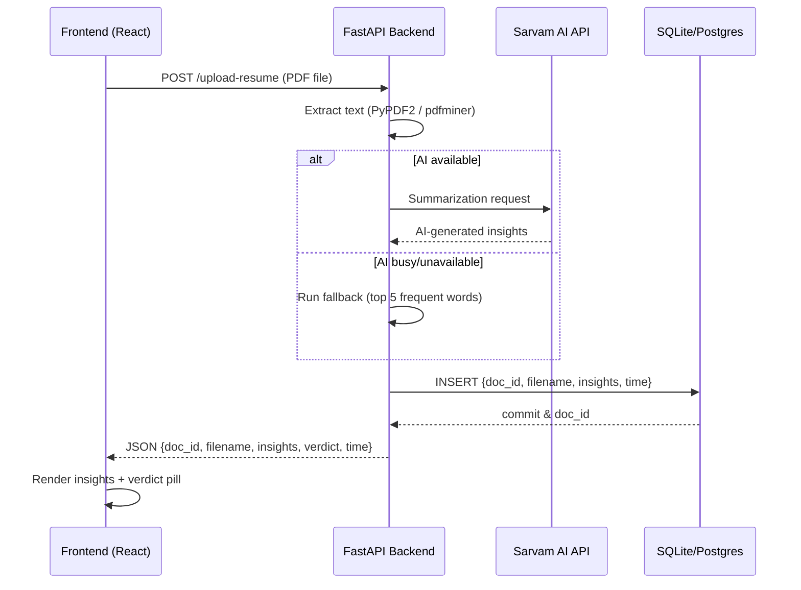

# 📄 AI-Doc-Insight-Tool  

AI-Doc-Insight-Tool is a full-stack application that allows users to upload documents (e.g., resumes) and instantly generate AI-powered insights and summaries. The tool also provides search, filtering, and PDF report downloads with clean formatting. 

## ✨ Features
- 🚀 **Resume Upload**: Upload PDF resumes through a clean React UI.  
- 🤖 **AI-Powered Insights**: Uses Sarvam AI to generate summaries of resumes.  
- 🛡 **Fallback Mechanism**: If AI is unavailable, returns the top 5 frequent words.  
- 📊 **Insights Viewer**: Displays results in a structured format with headings and a verdict pill.  
- 🗂 **History Tab**: Browse past uploads with search & sorting support.  
- 📑 **PDF Report Download**: Generate well-formatted PDF reports with insights.
- 🔍 Search and filter documents by filename or keywords.

## ⚙️ Tech Stack
- Frontend → React, TailwindCSS
- Backend → FastAPI, SQLAlchemy
- Database → SQLite (default, can be swapped with PostgreSQL/MySQL)
- AI Layer → Sarvam AI API (summarization)
- PDF Reports → ReportLab
---

## 🔧 Setup & Installation

### Backend

1. **Clone the repository:**
```bash
   git clone https://github.com/Mayur-143/AI-Doc-Insight-Tool.git
   cd AI-Doc-Insight-Tool/backend
 ```
2. **Create and activate a Python virtual environment:**
   - On macOS/Linux:
```bash
     python3 -m venv venv
     source venv/bin/activate
```
   - On Windows:
```bash 
     python -m venv venv
     venv\Scripts\activate
```
3. **Install required dependencies:**
```bash 
   pip install -r requirements.txt
```
   The backend uses FastAPI, SQLAlchemy, reportlab, pdfplumber, docx2txt, and dotenv among other libraries.

### Frontend

1. **Navigate to the frontend folder:**
```bash
   cd ../frontend
 ```
2. **Install Node dependencies:**
```bash
   npm install
```
   Alternatively, you can use yarn:
```bash
   yarn install
```

## Configuration

### Environment Variables

For proper backend functionality, create a `.env` file in the backend folder with the following environment variables:

- **SARVAM_API_KEY**: Set your API key for SarvamAI which is used for AI-driven summarization in resume evaluations.
- **DATABASE_URL**: The SQLite database URL is set by default as `sqlite:///./documents.db`, but you may adjust it as needed.

Example `.env` file:
```bash
SARVAM_API_KEY=your_sarvam_api_key_here
DATABASE_URL=sqlite:///./documents.db
```
or set env key in the Command prompt (PowerShell on Windows)
```bash
$env:SARVAM_API_KEY="your_api_key_here"
```

### CORS Settings

In the backend (`main.py`), CORS middleware is enabled to allow all origins. If you wish to modify allowed domains, update the `allow_origins` parameter.

## Usage

### Running the Backend Server

Run the backend server using Uvicorn:
```bash
uvicorn backend.main:app --reload
```
This command starts the FastAPI server with live reload enabled for development. The backend exposes endpoints such as:
- `/upload-resume`: Accepts resume files (PDF or DOCX) and returns analysis insights.
- `/insights`: Provides access to the detailed resume analysis history.
- `/download-report/{doc_id}`: Downloads a generated PDF report based on the resume insights.
Backend will run at → http://127.0.0.1:8000 

### Running the Frontend Application

After installing dependencies, start the frontend development server:
```bash
npm start
```
or with yarn:
```bash
yarn start
```
Frontend will run at → http://localhost:3000
The web app provides an interface where users can:
- **Upload Resumes:** In the “Upload Your Resume” section, choose a file (PDF or DOCX). 
- **View Insights:** Once a resume is processed, the insights are displayed with evaluation scores, summaries, and key details.
- **Download Reports:** A downloadable PDF report is generated for each analyzed resume.
- **Review History:** Navigate the "History" tab to review previous analyses with options to expand detailed insights and download corresponding reports.

### Building for Production

To create a production bundle for the frontend, run:
```bash
npm run build
```
This bundles the React application for deployment.

## 🖼 Sample Workflow
- Upload a resume PDF.
- Backend extracts text → calls Sarvam AI API for summarization.
- Insights are stored in the database.
- Frontend displays AI-generated insights.
- User can search, filter, and download the insights report (PDF).

### **Sequence Diagram: Upload Flow**



## 📂 Example API Endpoints
- POST /upload-resume → Uploads a PDF and generates insights.
- GET /insights → Fetch all uploaded documents with insights.
- GET /insights?doc_id=<id> → Fetch insights for a single document.
- GET /download-report/{doc_id} → Download formatted PDF report.

## 🌟 Future Enhancements
- User login/logout with secure sessions.
- Support for multiple document formats (DOCX, TXT).
- Enhanced AI insights (job fit, ATS score, recommendations).
- Deployment via Docker + CI/CD pipeline.
